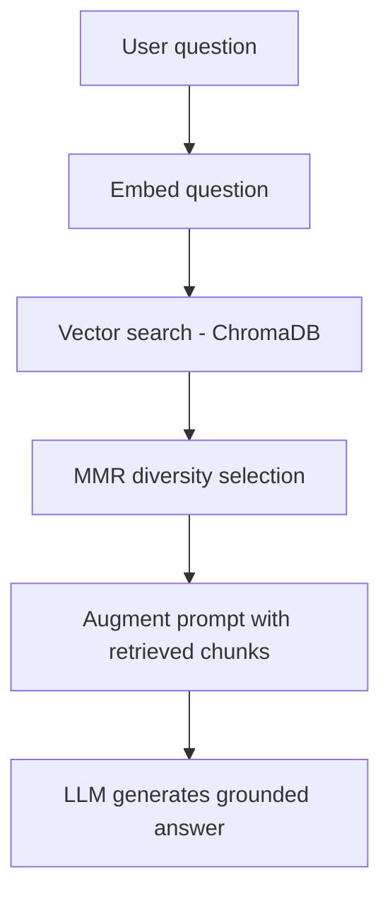

# Financial Services Regulatory Knowledge Assistant

A Retrieval-Augmented Generation system that answers questions grounded in real Central Bank of Ireland regulatory documents — built specifically to demonstrate, with measured evidence, why grounding matters and where it can still fall short.

## The problem

A language model's knowledge is frozen at training time, with no access to an organization's actual documents — and critically, it doesn't reliably say "I don't know" when asked about something outside that knowledge. It generates plausible, well-formatted text regardless of whether it's true. This project exists to prove that failure mode concretely, and to demonstrate the architecture that corrects for it.

## Architecture



A question is embedded with the same model used on the source documents, compared against a vector store of chunked regulatory text, and the top candidates are passed through Maximal Marginal Relevance selection before being inserted into the prompt alongside the original question. The system prompt explicitly restricts the model to the provided context, with an instruction to decline rather than guess when the evidence is insufficient.

## The corpus

Eight real, current, publicly available PDF documents sourced directly from the Central Bank of Ireland, covering the March 2026 Consumer Protection Code update: general consumer protection guidance, the regulatory consultation and feedback process itself, and insurance-sector-specific requirements. Deliberately varied — not just in topic, but in writing style (directive rule-setting versus discursive consultation Q&A) — specifically so retrieval quality could be tested against genuine ambiguity and topical overlap, not an artificially clean synthetic dataset.

## Key design decisions

**Two chunking strategies, stored separately, not merged.** Fixed-size and sentence-aware chunking were embedded into two independent ChromaDB collections, enabling direct, repeatable comparison of retrieval quality rather than asserting one approach is better without evidence.

**Maximal Marginal Relevance for diversity-aware retrieval.** Plain top-k similarity search has no concept of redundancy — it can return several near-identical chunks from the same document while a genuinely different, relevant perspective from another document never surfaces. MMR selects iteratively, balancing relevance against similarity to already-selected chunks, tunable via a lambda parameter.

**The system prompt is the actual grounding mechanism, not the retrieval step.** Retrieval only supplies candidate evidence; nothing prevents a model from ignoring it and answering from training memory unless explicitly instructed otherwise. The prompt requires the model to answer only from provided context and to state plainly when it cannot.

**A live, in-app comparison between grounded and ungrounded answers.** Rather than a bare question-answering tool, the interface runs both paths on every query and displays them side by side — turning the project's central argument into something a user can trigger and verify themselves, not a claim to take on faith.

## Real findings from testing

Documented honestly, including what didn't work, because a system's real limitations are more useful to know than a claim of perfection.

- **A genuine PDF extraction bug was found through a live retrieval result, not caught in advance.** A real query returned a chunk reading as nonsensical prose — traced to a source document containing genuine tables, which `pdfplumber`'s default text extraction silently concatenated column-by-column into false, misleading sentences. Fixed by detecting tables explicitly and rendering them as pipe-delimited rows rather than letting them masquerade as fluent, confident-looking text. Rebuilding the affected embeddings from scratch was required — corrected extraction alone does not retroactively fix already-stored vectors.

- **MMR's diversity benefit is bounded by what the initial retrieval actually returns.** On one real test question, two near-duplicate chunks from the same document survived selection even with MMR active — traced not to a flaw in the algorithm, but to the initial candidate pool being dominated by a single document (5 of 10 candidates). MMR can only diversify among what it is given.

- **Three distinct, real hallucination patterns were captured and compared directly against grounded answers on the same corpus:**
  1. A specific-fact hallucination — confidently citing fabricated Consumer Protection Code article numbers, versus the correct provisions when grounded.
  2. A wholesale fabricated narrative — inventing an entire regulatory history complete with a fake attributed quote and a fabricated effective date, versus an honest "I cannot answer this based on the provided documents" when grounded.
  3. A cross-jurisdiction hallucination — an ungrounded answer about vulnerable-customer protections confidently cited the UK's Financial Conduct Authority and US HIPAA law, entirely wrong regulatory bodies for a question specifically about Irish Central Bank guidance, with no signal anything had gone wrong.

- **Quantified, not just observed by eye.** A custom faithfulness-scoring function — decomposing an answer into individual claims and checking each against retrieved context — scored the grounded CPRA methodology answer at **1.00** (every claim traced to real source text with specific justification) and the fabricated risk-framework answer at **0.00** (zero claims supported). The same measurement, applied consistently, produced a clean, binary confirmation of what the earlier qualitative comparisons showed.

- **A third-party evaluation library (RAGAS) was attempted and ultimately replaced.** Four separate, confirmed issues were diagnosed through direct investigation — an unconditional import of a deprecated dependency crashing the library outright, a breaking API change in its embeddings interface, a genuine incompatibility between the library's internal tool-calling mechanism and this provider's strict validation, and an internal keyword-argument collision when attempting the documented workaround. Rather than continue patching an unreliable dependency, an equivalent faithfulness metric was implemented directly using the project's own proven structured-output pipeline (Pydantic validation over JSON-mode responses), reusing the identical claim-decomposition methodology.

## Known limitations

- **The evaluation set is small and hand-picked, not a systematic benchmark.** A handful of deliberately varied real test questions were used to surface genuine failure modes; a production system would need a larger, more systematically constructed evaluation set (industry practice commonly runs 50–200 question/answer pairs) to make confident, general claims about retrieval quality.
- **No subject-matter-expert validation of regulatory correctness has been performed.** This system is validated on traceability, consistency, and honest refusal behavior — properties an engineer can and should verify. It has not been reviewed by a compliance professional for the actual correctness of the underlying regulatory interpretation, which is a distinct, necessary step before any real deployment in a regulated context.
- **ChromaDB runs as a local, file-based store**, appropriate for this project's scale but not representative of a production vector database deployment.
- **Streamlit serves as a demonstration interface**, not a production-grade frontend — reruns the entire script on every interaction, which is acceptable at this scale but a real architectural constraint at higher traffic.

## Tech stack

Python, Streamlit, ChromaDB, `sentence-transformers` (`all-MiniLM-L6-v2`), Groq (`openai/gpt-oss-20b`), Pydantic, `pdfplumber`.

## Project structure

```
rag_core.py           # Shared retrieval and generation logic (used by both the app and evaluation scripts)
MMR.py                  # Maximal Marginal Relevance implementation
chunking.py              # Fixed-size and sentence-aware chunking strategies
extract_text.py          # PDF extraction, including table-aware handling
embed_store.py           # Embedding and ChromaDB collection setup
custom_faithfulness.py  # Claim-decomposition faithfulness scoring
app.py                    # Streamlit interface
```

## Running it locally

```bash
conda activate ai-automation
python3 -m pip install streamlit chromadb sentence-transformers groq pydantic python-dotenv pdfplumber

# .env file with GROQ_API_KEY=your_key_here

python3 -m streamlit run app.py
```
