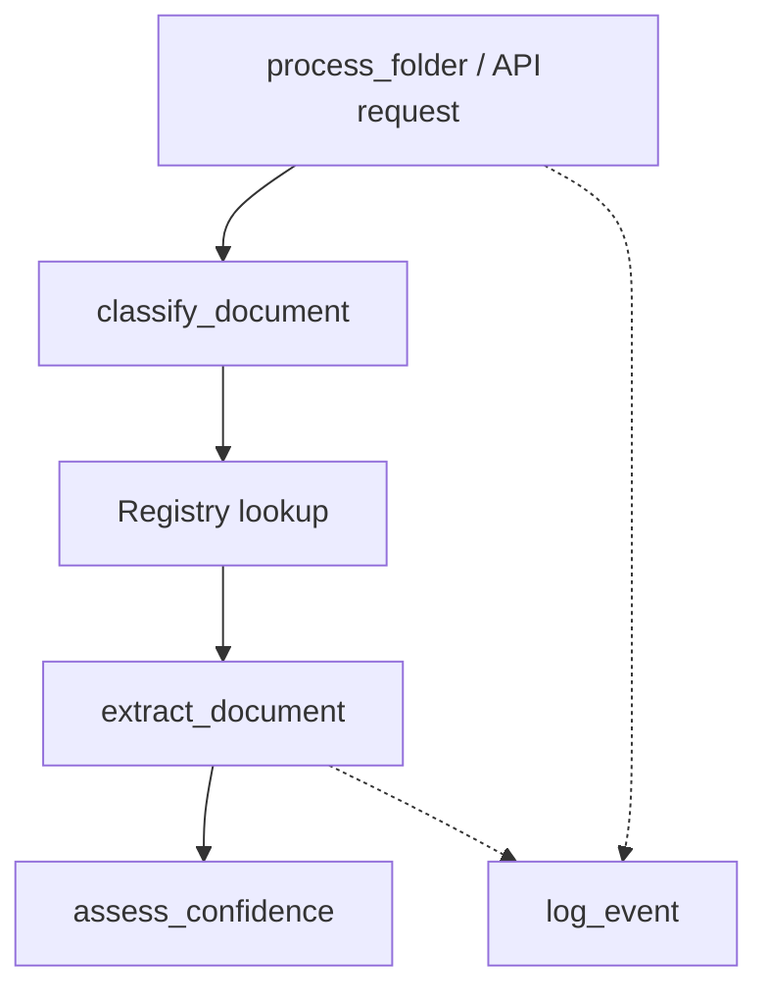

# AI Document Processing Bot

A REST API that reads a folder of mixed business documents — job applications, reference letters, offer forms — and extracts structured data using an LLM, without a fixed template per document type.

## The problem

Traditional RPA document processing works by building a fixed extraction template for each document type: define the exact coordinates or regex patterns for "invoice number," run it against invoices, and hope every invoice looks the same. The moment a vendor changes their layout, or a genuinely new document type shows up, the template breaks and someone has to build a new one.

This project replaces that with a two-stage AI pipeline: **classify the document type first, then route it to the correct extraction schema.** No fixed layout assumptions, no per-vendor templates — the system reasons about the document's actual content, the same way a human reviewer would.

## Architecture



A document enters through either a batch folder processor or the `/extract` API endpoint. It's classified into one of the registered types (or explicitly flagged as `unknown` if it doesn't confidently match anything), routed to the matching Pydantic schema, extracted with automatic retry-on-validation-failure, and passed through a confidence assessment before being marked complete. Every step logs a structured, timestamped event.

## Key design decisions

**Classify-then-route, not fixed schemas.** Adding a fourth document type means adding one entry to a registry — not rewriting the extraction pipeline. The extraction engine itself (`generic_extractor.py`) has no knowledge of what a "job application" or "invoice" is; it's a generic function parameterized by whichever Pydantic model and instruction the registry hands it.

**Two separate layers of Pydantic models.** Document *content* schemas (`JobApplication`, `ReferenceLetter`, `OfferAcceptance`) are kept fully independent of the API's *request/response contract* (`ExtractResponse`, `StatusResponse`). This means the internal extraction logic can be reused outside the API entirely (as it is, in the batch folder processor), and the API layer can evolve independently of what a document actually contains.

**Async job pattern, not a blocking endpoint.** A single document can take upwards of 10–15 seconds to classify, extract, and confidence-check. `POST /extract` returns a job ID in milliseconds via FastAPI's `BackgroundTasks`, with the real work continuing after the response is sent. Clients poll `GET /status/{job_id}` for the result. This is a deliberate, standard pattern for any API wrapping slow, LLM-backed work — a synchronous endpoint here would mean clients timing out or blocking on every request.

**A genuine `unknown` category, not a forced guess.** The classifier is explicitly permitted to say "this doesn't match any registered type" rather than being forced to pick the closest wrong answer. Closed-set classifiers that can't abstain will confidently misclassify anything they weren't built for — a real, common production failure mode this system is designed to avoid.

**Deterministic validation over self-reported trust.** Every extracted field passes through Pydantic validation (type coercion, enum constraints, cross-field arithmetic checks via `model_validator`) before it's ever considered "extracted." A retry loop feeds specific validation errors back to the model for correction, rather than accepting the first response that happens to parse.

## Real findings from testing

This system was deliberately stress-tested with adversarial documents, not just happy-path examples. The results are documented here honestly, including the failures — a system's real limitations are more useful to know than a claim of perfection.

- **The classifier's "unknown" escape hatch is real but unreliable.** Across repeated runs against a resignation letter (a document type deliberately similar in structure to a reference letter but semantically different), the classifier used `unknown` **zero times** despite an explicit system-prompt instruction to do so when uncertain — consistently misclassifying it instead. A prompt instruction shifts probability; it does not guarantee behavior.

- **A wrong-schema extraction attempt can produce hallucinated fields.** When forced to extract the resignation letter's real content into an `OfferAcceptance` schema, the model invented an entirely new field (`end_date`) not present in the schema at all, populating it with genuine data from the source document. The retry loop partially corrected across attempts but never fully resolved the invalid field within three tries — a concrete limit of corrective retry: it does not guarantee the model fixes the *specific* error flagged.

- **Self-reported confidence is measurably non-deterministic.** The same document, processed twice with identical code, produced different confidence assessments — one run correctly flagged two genuinely ambiguous fields as low-confidence with sound reasoning; a separate run on the same input flagged nothing. This confirms LLM self-assessment should be treated as a noisy signal, not a reliable one, and is why the confidence layer surfaces full per-field reasoning in the API response rather than a single trust/no-trust flag.

- **Malformed or corrupted source text does not necessarily break extraction.** A test invoice with a rotated watermark that corrupted the underlying PDF text stream (producing garbled strings like `"ATax (7%)"` instead of `"Tax (7%)"`) still extracted correctly — real evidence that LLM-based extraction is materially more resilient to noisy input than a fixed-position or regex-based parser would be.

## API

### `POST /extract`

Accepts a PDF file upload, returns a job ID immediately.

```bash
curl -X POST http://127.0.0.1:8000/extract -F "file=@job_application.pdf"
```

```json
{"job_id": "bc0b8c8c-80e2-4d2e-80f8-eeb42eea4e85", "status": "processing"}
```

### `GET /status/{job_id}`

Poll for the result. Status is one of `processing`, `success`, `needs_review`, or `failed`.

```bash
curl http://127.0.0.1:8000/status/bc0b8c8c-80e2-4d2e-80f8-eeb42eea4e85
```

```json
{
  "job_id": "bc0b8c8c-80e2-4d2e-80f8-eeb42eea4e85",
  "status": "needs_review",
  "document_type": "reference_letter",
  "data": {
    "referee_name": "Karen Voss",
    "candidate_name": "David Osei",
    "recommendation_strength": "weak"
  },
  "confidence_details": [
    {"field_name": "recommendation_strength", "confidence": "low", "reason": "lacks specific examples"},
    {"field_name": "relationship_duration", "confidence": "low", "reason": "vague and not specifically quantifiable"}
  ]
}
```

`needs_review` fires when the classifier can't confidently place a document, or when the confidence layer flags any extracted field as low-confidence — either way, the document is never silently treated as fully trustworthy without a clear signal.

### `POST /extract-batch`

Accepts multiple PDF files in one request, spins up one independent background job per file, and returns a job ID for each — reusing the exact same single-document pipeline underneath rather than a separate code path.

```bash
curl -X POST http://127.0.0.1:8000/extract-batch \
  -F "files=@job_application.pdf" \
  -F "files=@reference_letter.pdf"
```

```json
{
  "job_ids": [
    "1a2b3c4d-...",
    "5e6f7g8h-..."
  ]
}
```

Each `job_id` is polled independently against `GET /status/{job_id}`, exactly as in the single-document flow. This is a deliberate design choice: rather than one large batch job that succeeds or fails as a unit, every document in a batch gets its own isolated job — one malformed or unclassifiable file in a batch of ten never blocks or corrupts the other nine.

Note: this endpoint accepts uploaded file *content*, not a server-side folder path. A client cannot ask the API to read an arbitrary folder off its own filesystem — that would be a real path-traversal security risk. Genuine folder-based batch processing (reading every PDF from a local directory) is handled separately by `process_folder.py`, run directly on the machine where the files live, not through the API.

## Known limitations

Stated plainly rather than hidden:

- **Job storage is in-memory only.** Restarting the server loses all job history, and a multi-process deployment would have each process holding a separate, disconnected job store. A production deployment needs Redis or a database-backed job queue.
- **Self-reported confidence is a weak signal on its own**, as demonstrated above. A more rigorous production system would lean more heavily on the self-consistency approach (running extraction multiple times and checking field-level agreement) or combine both signals rather than trusting either alone.
- **Classification uses a single LLM call with no built-in consistency check.** Given the measured misclassification of the resignation letter, a production version would benefit from applying the same self-consistency technique to classification, not just extraction.

## Tech stack

Python, FastAPI, Pydantic v2, Groq (Llama 3.1 8B Instant), pdfplumber, uvicorn.

## Project structure

```
document_models.py    # Pydantic schemas for document content
classifier.py          # LLM-based document type classification
registry.py             # Maps document type -> schema + extraction instruction
generic_extractor.py   # Generic extract-validate-retry pipeline
confidence.py           # Self-reported per-field confidence assessment
logger_setup.py         # Structured JSON logging
api_models.py            # FastAPI request/response contracts
main.py                  # FastAPI application, async job orchestration
process_folder.py       # Batch folder processing (non-API entry point)
```

## Running it locally

```bash
conda activate ai-automation
python3 -m pip install fastapi uvicorn python-multipart groq pydantic python-dotenv pdfplumber

# .env file with GROQ_API_KEY=your_key_here

python3 -m uvicorn main:app --reload
```

Interactive API docs are available at `http://127.0.0.1:8000/docs` once running.

### Batch mode (no API)

```bash
python3 process_folder.py
```

Processes every PDF in `hr_inbox/`, printing a classification and extraction summary per file.
